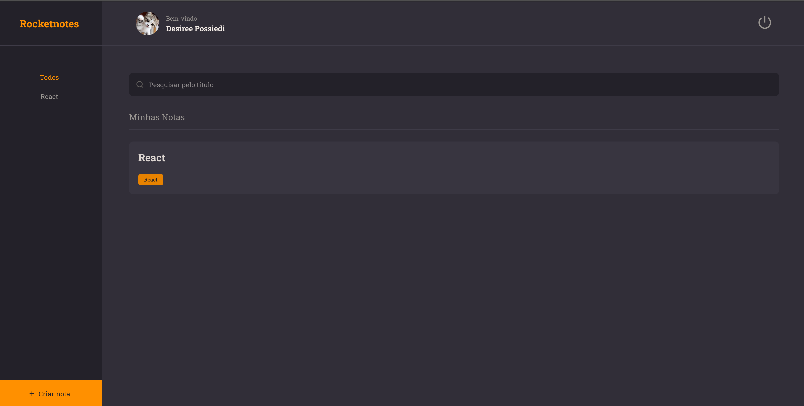

<h1 align="center"> RocketNotes </h1>

- Project developed during the course Explorer from RocketSeat using React and Vite. 

<h3>Preview 🎥</h3>

---

<h2>Features 🛠️</h2>

- Sign Up
- Sign In 
- Edit password 
- Add profile picture 
- Create notes with observations and links 
- Delete and edit 
- Reset password

---

<h2>Technologies 💻</h2>

- HTML 
- JavaScript 
- React 
- CSS-in-JS
- Vite 
- Styled Components 
- React Router 
- Git and Github 
- Netlify 

<h2>Usage 💡</h2>

- This project counts with a API that you can access [HERE](https://github.com/desireecvp/rocketnotes-api)

