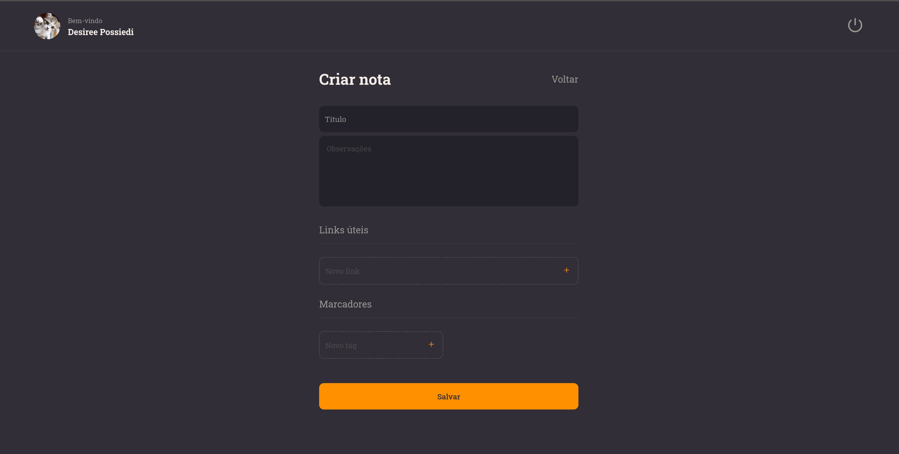

<h3 align="center">Online personal notes</h3>

<h2>Preview 🎥</h2>

---

# Rocket Notes 

- Project developed during the course Explorer from RocketSeat using React and Vite. 

## Functions 
- Sign Up
- Sign In 
- Edit password 
- Add profile picture 
- Create notes with observations and links 
- Delete and edit 
- Reset password

---

<h2>Technologies  🛠</h2>

- HTML 
- JavaScript 
- React 
- CSS-in-JS
- Vite 
- Styled Components 
- React Router 
- Git and Github 
- Netlify 

